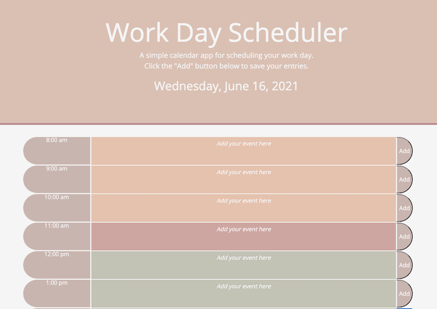

# Day Planner
## Objective ##

Create a simple calendar application that allows a user to save events for each hour of the day by modifying starter code. This app will run in the browser and feature dynamically updated HTML and CSS powered by jQuery.

## Criteria ##

* Displays current day at the top of daily schedule on load screen
* Planner contains time blocks for standard business hours (8am - 5pm)
* Color code the timeblock when the time has passed, present, and future
* When timeblock is clicked, user can enter an event and save the event to the planner
* Save activity to local storage with save buttons
* Upon refresh, activities stay listed in planner

## Screen Shot
### Key: Green - Future, Mauve - Current Hour, Peach - Past

## Links
* Deployed Site: https://bleufox.github.io/BleusDayPlanner/
* GitHub Repo: https://github.com/bleufox/BleusDayPlanner